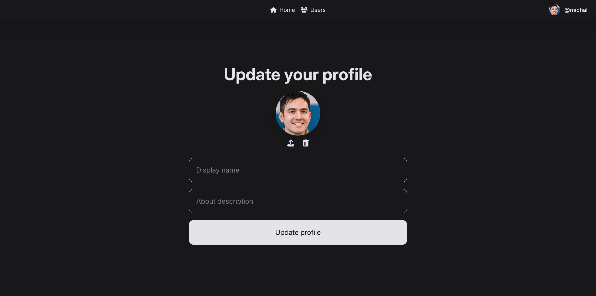
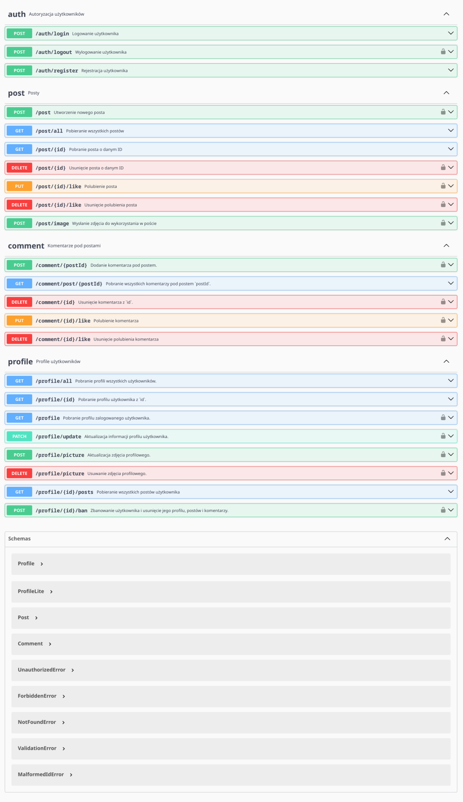

# VibeZone
**Serwis społecznościowy w stylu mikrobloga**

## Opis

Jest to serwis społecznościowy w postaci mikrobloga (podobny do twittera), w którym użytkownicy serwisu mogą postować krótkie wiadomości (do 150 znaków) na różne tematy. Ponadto jest możliwość wysyłania zdjęć do postów. Inni użytkownicy mają możliwość polubienia postów oraz komentowania na nie.

## Zrzuty ekranu:

Strona główna:

Strona posta z komentarzami:

Lista użytkowników:

Profil użytkownika:

Edycja profilu:

## Sposób uruchomienia:

Najpierw sklonować to repozytorium a potem wybrać jedną z opcji:

### Środowisko programistyczne (development):

1. Backend:
    1. Przejść do katalogu `server` (`cd ./server`)
    2. Zainstalować wszystkie potrzebne zależności (`npm install`)
    3. Ustawić potrzebne zmienne środowiskowe w pliku `.env.development`:
        - `MONGO_URI`: link do połączenia się z bazą danych MongoDB. Przykład: `mongodb://127.0.0.1:27017/vibezone`
        - `PORT`: port sieciowy na którym ma działać serwer API. Domyślnie 5000. Nie zmieniać jeśli nie ma potrzeby.
        - `SESSION_SECRET`: sekret dla generowania sesji (ciasteczek). Domyślnie jest generowany losowo za każdym uruchomieniem serwera. Najlepiej ustawić na stały wygenerowany w node.js za pomocą tego kodu: `crypto.randomBytes(64).toString("hex")`
    4. Uruchomić serwer za pomocą `npm run start`

2. Frontend:
    1. Przejść do katalogu `client` (`cd ./client`)
    2. Zainstalować wszystkie potrzebne zależności (`npm install`)
    3. Ważne: Jeżeli port serwera API (backendu) został zmieniony (np. na 6660) to należy utworzyć plik `.env.development` z następującą zawartością: `VITE_DEV_API_PORT=<port>` (np. `VITE_DEV_API_PORT=6660`)
    4. Uruchomić środowisko deweloperskie Vite za pomocą `npm run dev`. Od tej pory każda zmiana w kodzie źródłowym frontendu będzie automatycznie odświeżać stronę.

### Pod produkcję (Docker)

Projekt wykorzystuje trzy kontenery do działania:
- `server` - środowisko node do uruchomienia serwera API;
- `nginx` - reverse proxy do serwowania statycznych plików (html, css, js + wysłane zdjęcia) oraz przekierowania zapytań API do backendu (pod adresem `/api/*`)
- `mongodb` - baza danych do przechowywania wszelakich informacji (postów, komentarzy, użytkowników itd).

Zarządzanie i komunikacja między kontenerami jest 

1. Upewnić się czy Docker i Docker Compose jest zainstalowany i uruchomiony na komputerze/serwerze;
2. W pliku `server/.env.production` (utworzyć jeśli nie istnieje) należy ustawić zmienną `SESSION_SECRET` tak jak to opisano w punkcie 1.3 gdzie opisany jest proces przygotowania projektu pod środowisko programistyczne.
3. Uruchomić kontenery projektu za pomocą `docker compose up --build -d`. Strona będzie dostępna pod portem 80. Można zmienić port w razie konieczności - należy zmienić wartość `ports` w `compose.yaml` np. z `80:80` na `8080:80`.

## Dokumentacja API
Dokumentacja API jest napisana w specyfikacji OpenAPI 3.0.4 i znajduje się w `./server/swagger.yaml`.
Dostępna jest ona pod adresem `/` serwera API (np. `http://localhost:5000/`)

Podgląd:

## Diagram przypadków użycia

## Schematy bazy danych

